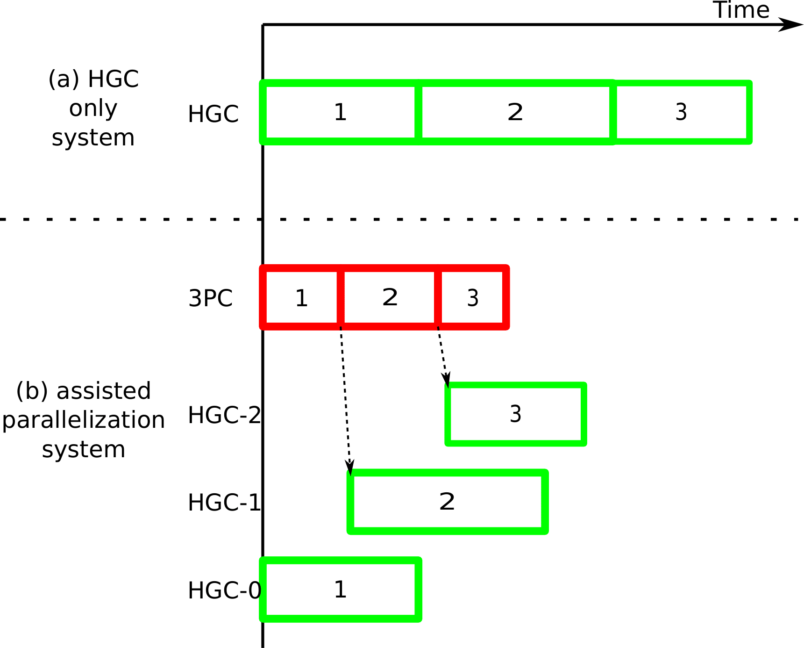

## Securing Neural Networks against Hardware Trojans through Assisted Parallelization

The threat of Hardware Trojans looms large on mission-critical applications. This research proposes a novel technique to employ low-performance, but trusted home-grown cores to verify the functioning of high-performance, untrusted, third-party cores. The technique caters to the execution of neural network applications, and ensures fast, yet trusted execution of the same. We demonstrate that the proposed technique of assisted neural network parallelization can significantly outperform a purely home-grown system, while ensuring security.

### Assisted Parallelization of Neural Networks

We essentially employed an array of HGCs to execute the neural network instead of a single one, each executing a different layer of the network, with their executions temporally overlapping with each other. This will allow the array of HGCs to execute the application **faster** than a single HGC would.

### Socket Communication

Since the data had to be communicated from 3PC to HGCs, we had to consider communication times between them as clearly they were significant.

### Constraints: Integer Linear Program

-   Every layer must be executed exactly once.
-   An HGC must execute a layer only if the layer inputs are available. If the previous layer has been executed on the same HGC, then the layer inputs need not be sought from the 3PC.
-   An HGC must execute only one layer at a time.
-   All layers have to complete execution on HGCs.

An ILP solver: [GLPSOL](https://en.wikibooks.org/wiki/GLPK/Using_GLPSOL) was used to strategically model above constraints and basically give us the optimal grouping of layers of neural networks.

### Implementation Design
- We perform an offline timing characterization of the given neural network’s execution on the 3PC and the HGCs.
- Optimal batching of layers and their schedule on the HGCs (considering communication overheads)

### Evaluation
- **Intial Approach**
[AxBench](http://axbench.org/) - a set of famous C/C++ benchmarks for CPUs, a set of CUDA benchmarks for GPUs, and a set of Verilog benchmarks for hardware design.

	_Problems_:
	- Neural Networks complexity was extremely small (network convolution of 3-4 layers).
	- The timings of temporal overlap and layerwise computation was << communication overheads which in general is never the case. 
- **Final Approach**
The neural network models were executed using the `Pytorch v1.1.0` and the `TorchVision v0.3.0` frameworks. The `TorchProfile` library was used for timing characterizations.

## Future Ideas
- The future idea to move forward from here is to actually implement the idea of Master-Slave Algorithm mentioned above in term of an application. Currently it's just a novel idea which we proposed and experimented with - next plan is to actually implement the logic design.
- It has to made in a systematic way so that any organization can put in a the constraint on HGCs and number of layers and then get optimal design for secure and accelerated parallelization through assistance of 3PC in a HGCs system.
